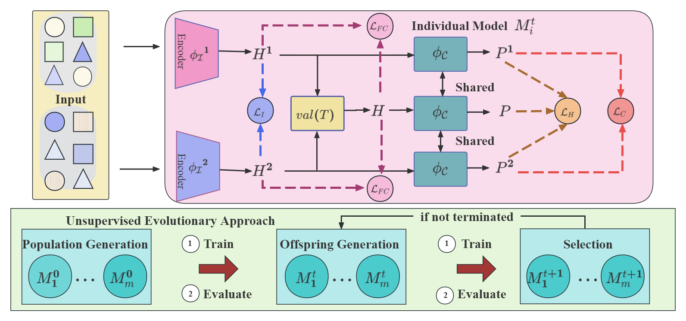

# Adaptive Evolutionary Fusion for Multi-View Clustering
This repo contains the Pytorch implementation of our paper

## Introduction

    

## Citation

@inproceedings{AEF-MVC,
  title={Adaptive Evolutionary Fusion for Multi-View Clustering},
  author={Yunxiao Zhao, Liang Bai, Xian Yang},
  booktitle={AAAI},
  year={2026}
}
